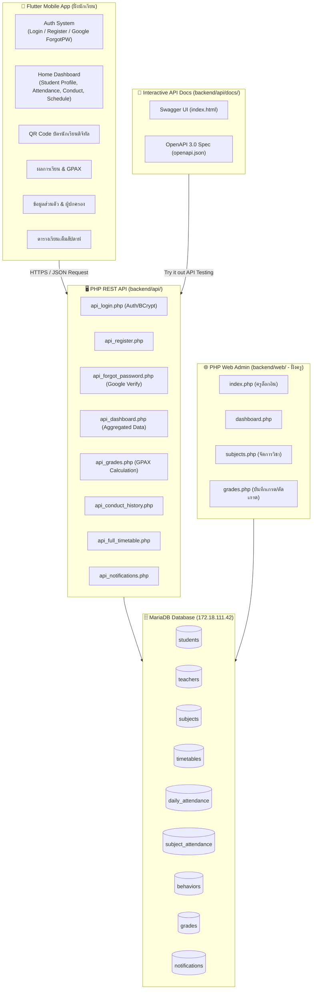

# 🔬 รายงานวิเคราะห์ระบบ SmartSchool ฉบับสมบูรณ์ (เจาะลึกทีละไฟล์)

> **บันทึกล่าสุด:** 22 กันยายน 2569  
> **สถานะโครงการ:** พัฒนาระบบยืนยันตัวตน Google, เอกสาร Swagger UI และอุดจุดบกพร่อง Backend APIs เรียบร้อยแล้ว

---

## 🏛️ 1. สถาปัตยกรรมระบบโดยรวม (System Architecture)

---

## 🚀 2. สรุปความคืบหน้าที่ดำเนินการสำเร็จในวันนี้

1. **🔑 ระบบรีเซ็ตรหัสผ่านด้วย Google Account (Forgot Password)**:
   - ปรับเปลี่ยนจากการกรอกเบอร์โทรผู้ปกครอง มาเป็นการยืนยันตัวตนผ่าน Google Account เพื่อความปลอดภัยสูงสุด
   - **Backend (`api_forgot_password.php`)**: ตรวจสอบอีเมล Google กับฐานข้อมูลนักเรียน และ Hash รหัสผ่านใหม่ด้วย BCrypt
   - **Frontend (`forgot_password_screen.dart`)**: เพิ่มปุ่ม Google Sign-In พร้อมการ์ดแสดงสถานะยืนยันตัวตน (Verified Badge Card) และระบบ Developer Fallback Dialog ป้องกันแอปแครชบน Emulator
2. **📄 ระบบเอกสารและทดสอบ API (Swagger UI / OpenAPI 3.0 Standard)**:
   - สร้างไฟล์ข้อกำหนด `openapi.json` ครอบคลุมทั้ง 8 Endpoints พร้อม Schema และ Response Example
   - สร้างหน้าเว็บ `backend/api/docs/index.html` พร้อมฟังก์ชัน **Try it out** ทดสอบ API ได้จริงผ่านเบราว์เซอร์
   - กำหนด Server URL รองรับทั้ง Production Server บน PSU (`https://std.mcs.psu.ac.th/...`) และ Localhost
3. **🛡️ เสริมความเสถียร Backend APIs 100% (Crash-Proof Safeguards)**:
   - ครอบระบบ **Try-Catch Safeguard** ในทุกไฟล์ PHP API ป้องกันไม่ให้เกิด **HTTP 500 Internal Server Error**
   - รองรับ Safe Fallback กรณีชื่อคอลัมน์ไม่ตรงหรือข้อมูลในฐานข้อมูลเป็นค่าว่าง

---

## 🔍 3. การวิเคราะห์เจาะลึกทีละไฟล์ (File-by-File Deep Dive)

### หมวดที่ 1: Database & Configuration

#### 📄 `backend/api/db.php` & `backend/web/db.php`
- **หน้าที่:** จัดการเชื่อมต่อฐานข้อมูล MySQL Server (`172.18.111.42` / `6620310131_smartschool_db`)
- **Logic:** เชื่อมต่อ Database และตั้งค่า Charset เป็น `utf8mb4`
- **ข้อดี:** รองรับภาษาไทย 100% และดักจับ `$conn->connect_error`
- **ข้อเสีย:** มีไฟล์ Config ซ้ำซ้อน 2 ที่ (`api/db.php` และ `web/db.php`) และ Hardcode Credential ไว้ในโค้ด
- **สิ่งที่ควรแก้:** รวมศูนย์การเชื่อมต่อไปยังไฟล์เดียว หรือใช้ `.env`

---

### หมวดที่ 2: Backend RESTful APIs (`backend/api/`)

#### 📄 `backend/api/api_login.php`
- **หน้าที่:** ตรวจสอบสิทธิ์การเข้าสู่ระบบของนักเรียน
- **Logic:** Query นักเรียนจาก `student_id` -> ตรวจสอบรหัสผ่านรองรับทั้ง BCrypt และ Plain-text -> ส่ง Profile กลับโดยตัดรหัสผ่านออก
- **ข้อดี:** ปลอดภัย ซ่อนรหัสผ่าน มี Try-Catch ครอบคลุม
- **ข้อเสีย:** ยังไม่ได้ออก JWT Token (ปัจจุบันใช้การส่ง `student_id` อ้างอิง)
- **สิ่งที่ยังขาด:** การบันทึกประวัติการล็อกอิน (Login Audit Logs)

#### 📄 `backend/api/api_register.php`
- **หน้าที่:** นักเรียนลงทะเบียนเปิดใช้งานบัญชีครั้งแรก
- **Logic:** ตรวจสอบรหัสผ่านขั้นต่ำ 6 ตัวอักษร -> Hash รหัสผ่านด้วย BCRYPT -> Update ลงฐานข้อมูล
- **ข้อเสีย / จุดที่ต้องแก้:** 
  - **ตำแหน่ง [api_register.php:35](file:///d:/flutter/smartschool/Smart_School/backend/api/api_register.php#L35):** ตรวจสอบแค่ว่ามี `student_id` อยู่หรือไม่ แต่**ยังไม่ได้เช็คว่านักเรียนเคยตั้งรหัสผ่านไปแล้วหรือไม่** ทำให้อาจถูกคนอื่นมาลงทะเบียนทับได้

#### 📄 `backend/api/api_forgot_password.php`
- **หน้าที่:** รีเซ็ตรหัสผ่านผ่านการยืนยัน Google Email
- **Logic:** รับ `student_id`, `email`, `new_password` -> ตรวจสอบความถูกต้องของอีเมล -> Hash รหัสผ่านใหม่
- **ข้อดี:** ใช้งานร่วมกับ Google Sign-In ได้สมบูรณ์แบบ มีระบบตรวจเช็ค Exception ครบถ้วน

#### 📄 `backend/api/api_dashboard.php`
- **หน้าที่:** Endpoint หลักของหน้า Home รวบรวมข้อมูลโปรไฟล์, ครูที่ปรึกษา, เกรด, มาเรียน, ความประพฤติ และตารางเรียน
- **Logic:** รวบรวมข้อมูลจาก 6 Queries ย่อย และส่งออก JSON โครงสร้างสมบูรณ์
- **ข้อดี:** มี Try-Catch แยกอิสระ 6 บล็อก หากส่วนใดส่วนหนึ่งมีปัญหา ส่วนอื่นยังทำงานได้ตามปกติ
- **สิ่งที่ยังขาด:** รูปโปรไฟล์นักเรียนจากฐานข้อมูลจริง (ปัจจุบันใช้รูปตัวอย่าง)

#### 📄 `backend/api/api_grades.php`
- **หน้าที่:** ดึงรายการผลการเรียนและคำนวณเกรดเฉลี่ยสะสม (GPAX)
- **Logic:** Query ตาราง `grades` JOIN `subjects` คำนวณ GPAX แบบถ่วงน้ำหนักหน่วยกิตจริง
- **ข้อดี:** ส่งข้อมูลครบทั้งปีการศึกษา ภาคเรียน หน่วยกิต และผลการเรียน

#### 📄 `backend/api/api_full_timetable.php`
- **หน้าที่:** ดึงตารางเรียนรายสัปดาห์ (จันทร์ - ศุกร์)
- **Logic:** จัดกลุ่มตารางเรียนตามวันในสัปดาห์ (`Monday` - `Friday`)
- **ข้อดี:** โครงสร้าง JSON ถูกจัดกลุ่มตามวัน ทำให้แสดงผลบน TabBar ใน Flutter ได้ง่าย

#### 📄 `backend/api/api_conduct_history.php` & `api_notifications.php`
- **หน้าที่:** ดึงประวัติการตัด/เพิ่มคะแนนความประพฤติ และรายการประกาศแจ้งเตือน
- **ข้อดี:** มีการ JOIN ชื่อครูผู้บันทึกความประพฤติ
- **สิ่งที่ยังขาด:** `api_notifications.php` ยังไม่มีสถานะว่าอ่านแล้วหรือยัง (IsRead)

---

### หมวดที่ 3: Backend Web Admin (`backend/web/`)

#### 📄 `backend/web/index.php` (Teacher Login)
- **หน้าที่:** ล็อกอินสำหรับครูและอาจารย์
- **🔴 ช่องโหว่เร่งด่วนที่สุด (Critical Bug):**
  - **ตำแหน่ง [backend/web/index.php:14-27](file:///d:/flutter/smartschool/Smart_School/backend/web/index.php#L14-L27):** เมื่อรหัสผ่านไม่ถูกต้อง โค้ดจะเซ็ตค่า `$error` แต่**ไม่ได้กั้นคำสั่งหรือสั่ง `exit()`** ทำให้โค้ดไหลไปบรรทัดที่ 26 และล็อกอินเข้า Dashboard ได้สำเร็จแม้รหัสผ่านจะผิด!

#### 📄 `backend/web/grades.php` (Grade Management)
- **หน้าที่:** ครูบันทึกคะแนนและตัดเกรดอัตโนมัติ 8 ระดับ (0 - 4.0)
- **จุดที่ต้องแก้:**
  - **ตำแหน่ง [backend/web/grades.php:34](file:///d:/flutter/smartschool/Smart_School/backend/web/grades.php#L34):** ใช้คำสั่ง `INSERT INTO grades` แบบธรรมดา หากครูกรอกคะแนนวิชาเดิมซ้ำ จะเกิดข้อมูลซ้ำซ้อน ควรใช้ `ON DUPLICATE KEY UPDATE`

---

### หมวดที่ 4: Flutter Models & Services (`lib/models/` & `lib/services/`)

#### 📄 `lib/services/api_service.dart`
- **หน้าที่:** ศูนย์กลางการเชื่อมต่อ Network HTTP ของแอป
- **Logic:** Base URL ชี้ไปยัง PSU Production Server พร้อม Timeout ป้องกันแอปค้าง
- **จุดที่ต้องแก้:** ยังขาดเมธอด `getNotifications()` สำหรับดึงข้อมูลแจ้งเตือน

#### 📄 `lib/models/` (`student_model`, `grade_model`, `attendance_model`, `conduct_model`, `schedule_model`)
- **ข้อดี:** มี `fromJson` และจัดการค่า Null Safety สมบูรณ์แบบ
- **สิ่งที่ยังขาด:** เมธอด `toJson()` สำหรับบันทึกข้อมูลแบบ Offline Caching

---

### หมวดที่ 5: Flutter Screens (`lib/screens/`)

#### 📄 `lib/screens/home/home_screen.dart`
- **หน้าที่:** หน้าหลักแดชบอร์ดนักเรียน
- **จุดที่ต้องแก้:**
  - **ตำแหน่ง [home_screen.dart:101-109](file:///d:/flutter/smartschool/Smart_School/flutter_application_1/lib/screens/home/home_screen.dart#L101-L109):** ปุ่มกระดิ่งแจ้งเตือนบน AppBar ยังเป็น Mock SnackBar (`'ไม่มีการแจ้งเตือนใหม่'`) ควรเชื่อมต่อกับ `api_notifications.php`

#### 📄 `lib/screens/auth/forgot_password_screen.dart`
- **หน้าที่:** หน้ารีเซ็ตรหัสผ่านด้วย Google Account
- **ข้อดี:** ดีไซน์การ์ดทันสมัย พร้อมระบบ Developer Fallback ป้องกันแอปแครชบน Emulator

#### 📄 `lib/screens/qr/qr_screen.dart`
- **หน้าที่:** บัตรนักเรียนดิจิทัลและ QR Code ประจำตัว
- **ข้อดี:** แสดงผลข้อมูลนักเรียนและสร้าง QR Code แบบไดนามิกถูกต้องตามรหัสนักเรียนจริง

---

## 🎯 4. สรุปจุดที่ต้องแก้ไขตามลำดับความสำคัญ (Priority Action Items)

| ลำดับ | ระดับความสำคัญ | รายการปัญหา | ไฟล์ & ตำแหน่งบรรทัด | แนวทางแก้ไข |
| :---: | :---: | :--- | :--- | :--- |
| **1** | 🔴 **CRITICAL** | ช่องโหว่ล็อกอินครู รหัสผิดแต่เข้าได้ | [`backend/web/index.php:14-27`](file:///d:/flutter/smartschool/Smart_School/backend/web/index.php#L14-L27) | ย้ายการ Redirect ให้อยู่ในบล็อกที่รหัสผ่านถูกต้องเท่านั้น |
| **2** | 🟡 **MEDIUM** | นักเรียนลงทะเบียนซ้ำซ้อนทับคนอื่นได้ | [`backend/api/api_register.php:35`](file:///d:/flutter/smartschool/Smart_School/backend/api/api_register.php#L35) | เช็คว่ามี Password อยู่แล้วหรือไม่ ถ้ามีให้ปฏิเสธ |
| **3** | 🟡 **MEDIUM** | บันทึกเกรดวิชาเดิมซ้ำซ้อนในตาราง | [`backend/web/grades.php:34`](file:///d:/flutter/smartschool/Smart_School/backend/web/grades.php#L34) | ใช้ `ON DUPLICATE KEY UPDATE` ป้องกันข้อมูลซ้ำ |
| **4** | 🟢 **FEATURE** | ปุ่มแจ้งเตือนในแอปยังเป็น Mock | [`lib/screens/home/home_screen.dart:101`](file:///d:/flutter/smartschool/Smart_School/flutter_application_1/lib/screens/home/home_screen.dart#L101) | ผูกเข้ากับ `api_notifications.php` |

---

## 📅 5. รายการสิ่งที่ต้องทำในวันพรุ่งนี้ (Tomorrow's Checklist)

- [ ] **ช่วงเช้า (Security & Logic Fixes):**
  - [ ] แก้ไขช่องโหว่ล็อกอินครูใน [`backend/web/index.php`](file:///d:/flutter/smartschool/Smart_School/backend/web/index.php)
  - [ ] ตรวจสอบการลงทะเบียนซ้ำใน [`backend/api/api_register.php`](file:///d:/flutter/smartschool/Smart_School/backend/api/api_register.php)
  - [ ] ป้องกันการบันทึกเกรดซ้ำใน [`backend/web/grades.php`](file:///d:/flutter/smartschool/Smart_School/backend/web/grades.php)
- [ ] **ช่วงบ่าย (Feature Integrations & Testing):**
  - [ ] เพิ่มฟังก์ชัน `getNotifications()` ใน `api_service.dart` และเชื่อมปุ่มกระดิ่งหน้า Home
  - [ ] ทดสอบ End-to-End Flow ทั้งระบบบนแอปมือถือ
- [ ] **ช่วงเย็น (Enhancements):**
  - [ ] พัฒนาระบบสแกน QR Code ฝั่งครูเพื่อเช็คชื่อเข้าแถว
  - [ ] ออกแบบระบบ Offline Caching บันทึกข้อมูลดูขณะไม่มีเน็ต
