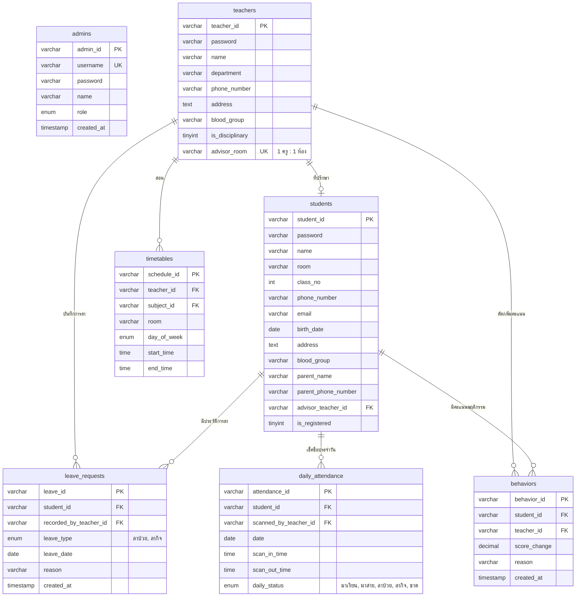

# 📑 เอกสารวิเคราะห์ระบบ SmartSchool & แผนปรับปรุงฐานข้อมูลฉบับสมบูรณ์

> **วันที่จัดทำ:** 26 กันยายน 2569  
> **หัวข้อ:** ผลการตรวจสอบความครบถ้วนของระบบตามเงื่อนไข (นักเรียน / ครู / Admin) และแผนการปรับโครงสร้างฐานข้อมูล (Database Migration Plan)

---

## 📌 บทสรุปผู้บริหาร (Executive Summary)

จากการตรวจสอบ Source Code ทั้งหมดในระบบปัจจุบัน:
* **ฐานข้อมูล (MariaDB Server 172.18.111.42):** มีตารางพื้นฐาน 8 ตาราง
* **Backend APIs (`backend/api/`):** 15 ไฟล์ PHP RESTful APIs
* **Web Portal (`backend/web/`):** 6 ไฟล์ PHP
* **Mobile Application (`flutter_application_1/lib/`):** Flutter Cross-platform App

**ผลการประเมินความพร้อม:** **"ยังไม่ครบถ้วนตามข้อกำหนด (ความพร้อมอยู่ที่ประมาณ 50-55%)"** โดยมีฟังก์ชันพื้นฐานที่ใช้งานได้แล้ว แต่ยังมีเงื่อนไขทางธุรกิจสำคัญของทั้งนักเรียน ครู และ Admin ที่ยังขาดอยู่ รวมถึงบัคสำคัญที่ต้องแก้ไข

---

## 🔍 1. รายงานผลการตรวจสอบเทียบกับข้อกำหนดจริง (Role-by-Role Gap Audit)

### 👨‍🎓 1.1 บทบาท: นักเรียน (Student)

| ข้อกำหนด | สถานะ | ไฟล์ที่เกี่ยวข้อง | ผลการตรวจสอบเจาะลึก |
| :--- | :---: | :--- | :--- |
| **1. มีรหัสตัวเองเพื่อเข้าสู่ระบบ** | ✅ ครบ | [login_screen.dart](file:///d:/Smart_School/flutter_application_1/lib/screens/auth/login_screen.dart)<br>[api_login.php](file:///d:/Smart_School/backend/api/api_login.php) | เข้าสู่ระบบด้วย `student_id` และ `password` ได้ถูกต้อง มีระบบตรวจสอบรหัสผ่าน BCrypt และ Plain-text |
| **2. แดชบอร์ดดู มา, สาย, ขาด, ลากิจ, ลาป่วย, อาจารย์ที่ปรึกษา** | ❌ ยังไม่ครบ | [api_dashboard.php](file:///d:/Smart_School/backend/api/api_dashboard.php#L40)<br>[daily_attendance](file:///d:/Smart_School/6620310131_smartschool_db.sql#L61) | • **ขาดการแยก ลาป่วย/ลากิจ:** ตารางฐานข้อมูลมีแค่ `'ลา'` รวมกัน ในแอปจึงแสดงลาป่วยเป็น 0 เสมอ<br>• **อาจารย์ที่ปรึกษา:** ตาราง `students` ไม่มีคอลัมน์ `advisor_teacher_id` โค้ด SQL JOIN พัง จึง fallback เป็น "ครูสมชาย ใจดี" ให้เด็กทุกคน |
| **3. ดูคะแนนพฤติกรรม/ประวัติ หากต่ำกว่า 80 ไม่ผ่านเกณฑ์** | ⚠️ ยังไม่ครบ | [conduct_card.dart](file:///d:/Smart_School/flutter_application_1/lib/screens/home/widgets/conduct_card.dart)<br>[api_dashboard.php](file:///d:/Smart_School/backend/api/api_dashboard.php) | ดึงคะแนนและประวัติได้ แต่เกณฑ์ปัจจุบันระบุเป็น (90=A, 80=B, ผ่านเกณฑ์) **ยังไม่มีป้ายหรือ Logic แจ้งเตือนว่า "ต่ำกว่า 80 คะแนน = ไม่ผ่านเกณฑ์"** ตามข้อกำหนด |
| **4. ดูเกรดแต่ละรายวิชาได้** | ✅ ครบ | [grades_screen.dart](file:///d:/Smart_School/flutter_application_1/lib/screens/grades/grades_screen.dart)<br>[api_grades.php](file:///d:/Smart_School/backend/api/api_grades.php) | ใช้งานได้สมบูรณ์ ดึงข้อมูลเกรด คะแนนรวม หน่วยกิต และคำนวณ GPAX ได้จริง |
| **5. ดูประวัติส่วนตัวและข้อมูลผู้ปกครอง** | ✅ ครบ | [profile_screen.dart](file:///d:/Smart_School/flutter_application_1/lib/screens/profile/profile_screen.dart)<br>[guardian_card.dart](file:///d:/Smart_School/flutter_application_1/lib/screens/home/widgets/guardian_card.dart) | แสดงข้อมูลผู้เรียน เบอร์โทร ที่อยู่ และข้อมูลผู้ปกครองครบถ้วน |
| **6. สแกน QR เช้า-เย็น (ไม่สแกนช่วงใดช่วงหนึ่ง -3, ลาในไลน์แล้วครูกรอก)** | ⚠️ ยังไม่ครบ | [qr_screen.dart](file:///d:/Smart_School/flutter_application_1/lib/screens/qr/qr_screen.dart)<br>[api_teacher_attendance.php](file:///d:/Smart_School/backend/api/api_teacher_attendance.php#L126) | • หน้า QR นักเรียนใช้งานได้<br>• สแกนเย็นแต่ไม่มีสแกนเช้า หัก 3 คะแนน: มี Logic แล้ว<br>• **สิ่งที่ยังขาด:** ยังไม่มีระบบบันทึกการลาสำหรับครูที่ปรึกษา |
| **7. สแกนเกิน 8:00 หักนาทีละ 0.1, หากไม่สแกนเลย เที่ยงวันถือว่าขาด** | ⚠️ ยังไม่ครบ | [api_teacher_attendance.php](file:///d:/Smart_School/backend/api/api_teacher_attendance.php#L68) | • หลัง 08:00 หักนาทีละ 0.1: คำนวณถูกต้อง<br>• **ขาดสแกนตอนเที่ยงวัน:** ยังไม่มีระบบ Cron Job/Scheduled Task ตอน 12:00 น. |
| **8. ดูตารางเรียนตัวเองได้** | ✅ ครบ | [full_timetable_screen.dart](file:///d:/Smart_School/flutter_application_1/lib/screens/timetable/full_timetable_screen.dart)<br>[schedule_card.dart](file:///d:/Smart_School/flutter_application_1/lib/screens/home/widgets/schedule_card.dart) | แสดงตารางเรียนทั้งหน้า Home และหน้าตารางเต็มสัปดาห์ (จันทร์-ศุกร์) |

---

### 👩‍🏫 1.2 บทบาท: ครู (Teacher)

| ข้อกำหนด | สถานะ | ไฟล์ที่เกี่ยวข้อง | ผลการตรวจสอบเจาะลึก |
| :--- | :---: | :--- | :--- |
| **1. มีรหัสประจำตัวครูเพื่อเข้าสู่ระบบ** | ✅ ครบ | [login_screen.dart](file:///d:/Smart_School/flutter_application_1/lib/screens/auth/login_screen.dart)<br>[api_teacher_login.php](file:///d:/Smart_School/backend/api/api_teacher_login.php) | เข้าสู่ระบบด้วยรหัสครู (เช่น `T001`) และรหัสผ่านได้ถูกต้อง |
| **2. แดชบอร์ดดูคาบสอนวันนี้, สถิติห้องที่ปรึกษา (1 คน : 1 ห้อง) มา/สาย/ป่วย/ลากิจ/ขาด และดูได้ว่าใครขาดใครลา** | ❌ ยังไม่ครบ | [api_teacher_dashboard.php](file:///d:/Smart_School/backend/api/api_teacher_dashboard.php)<br>[teacher_home_screen.dart](file:///d:/Smart_School/flutter_application_1/lib/screens/teacher/teacher_home_screen.dart) | • **ยังไม่มีฟิลด์ห้องที่ปรึกษา (1 ครู : 1 ห้อง)** ใน DB<br>• สถิติยังไม่แยก ป่วย/ลากิจ/ขาด<br>• **ยังไม่มีการแสดงรายชื่อว่าใครขาด ใครลา** ในหน้าแดชบอร์ด<br>• ตารางสอนวันนี้มี Bug Key Mismatch (JSON snake_case vs Model camelCase) ทำให้ชื่อวิชาขึ้นว่าง |
| **3. ระบบบันทึกการลา (กรอกเฉพาะห้องตัวเอง, ไม่ใช่ที่ปรึกษาให้ซ่อนปุ่ม)** | ❌ ยังไม่มีเลย | `leave_requests`<br>[teacher_home_screen.dart](file:///d:/Smart_School/flutter_application_1/lib/screens/teacher/teacher_home_screen.dart) | ยังไม่มีทั้งตารางฐานข้อมูล, API และหน้าจอ UI ให้ครูที่ปรึกษากรอกข้อมูล รวมถึงยังไม่มี Logic ซ่อนปุ่ม |
| **4. เช็คชื่อคาบที่ตัวเองสอน ดูกี่ห้องกี่คาบก็ได้ ดูข้ามวันได้ (เช่น วันจันทร์ดูคาบวันอังคาร)** | ❌ ยังไม่ครบ | [api_teacher_subject_attendance.php](file:///d:/Smart_School/backend/api/api_teacher_subject_attendance.php#L65)<br>[teacher_navigation.dart](file:///d:/Smart_School/flutter_application_1/lib/screens/teacher/teacher_navigation.dart) | • มี Bug ร้ายแรงใน API: ฮาร์ดโค้ด `teacher_id = 'SYSTEM'` ทำให้ติด Foreign Key Error บันทึกเด็กขาดไม่ได้<br>• ในแอป Flutter ยังไม่มีหน้าเลือกวันเพื่อดูคาบสอนล่วงหน้า และไม่มีหน้าเลือกคาบเพื่อเช็คชื่อรายคาบ |
| **5. สแกน QR เช้า-เย็น / พิมพ์รหัสแทนได้ / ซ่อนปุ่มถ้าไม่ใช่ที่ปรึกษาหรือครูปกครอง** | ⚠️ ยังไม่ครบ | [teacher_qr_scanner_screen.dart](file:///d:/Smart_School/flutter_application_1/lib/screens/teacher/teacher_qr_scanner_screen.dart)<br>[teacher_navigation.dart](file:///d:/Smart_School/flutter_application_1/lib/screens/teacher/teacher_navigation.dart) | • สแกน QR และพิมพ์รหัสนักเรียนแทนได้แล้ว<br>• **ยังไม่ได้ซ่อนปุ่ม:** ปัจจุบันครูทุกคนกดเข้าสแกนได้หมด ยังไม่มีการตรวจเงื่อนไข `is_disciplinary` หรือ `is_advisor` |
| **6. บวก/ลบคะแนนพฤติกรรม (กรอกรหัส, คะแนน, เหตุผล) เฉพาะฝ่ายปกครอง หากไม่ใช่ให้ซ่อน** | ⚠️ มีแต่ยังไม่ซ่อน | [teacher_profile_screen.dart](file:///d:/Smart_School/flutter_application_1/lib/screens/teacher/teacher_profile_screen.dart)<br>[api_teacher_conduct.php](file:///d:/Smart_School/backend/api/api_teacher_conduct.php) | ฟังก์ชันบันทึกคะแนนทำได้จริง ตรวจสิทธิ์ใน API แล้ว แต่ในหน้าจอทำแค่ Disable ช่องกรอก **ยังไม่ได้ซ่อนฟอร์มไปเลย** ตามที่ต้องการ |
| **7. ดูข้อมูลส่วนตัวครูได้** | ✅ ครบ | [teacher_profile_screen.dart](file:///d:/Smart_School/flutter_application_1/lib/screens/teacher/teacher_profile_screen.dart) | แสดงข้อมูลกลุ่มสาระ เบอร์โทร ที่อยู่ หมู่เลือด ครบถ้วน |

---

### 👑 1.3 บทบาท: ผู้ดูแลระบบ (Admin)

| ข้อกำหนด | สถานะ | รายละเอียด |
| :--- | :---: | :--- |
| **Role Admin ในระบบ** | ❌ **ยังไม่มีเลย (0%)** | ในฐานข้อมูลปัจจุบันมีแค่ตาราง `students` และ `teachers` ยังไม่มีตาราง `admins` ไม่มีหน้าจอล็อกอิน Admin และยังไม่มีระบบจัดการหลังบ้าน (CRUD เพิ่มครู, กำหนดห้องที่ปรึกษา, จัดตารางสอน) ปัจจุบันต้องจัดการผ่าน phpMyAdmin ด้วยตนเอง |

---

## 🏛️ 2. แผนผังความสัมพันธ์ฐานข้อมูลใหม่ (New ER Diagram)



---

## 💻 3. สคริปต์ SQL Migration (พร้อมรันใน phpMyAdmin)

```sql
-- ========================================================
-- 1. ปรับปรุงตาราง daily_attendance ให้รองรับ ลาป่วย / ลากิจ
-- ========================================================
ALTER TABLE `daily_attendance` 
  MODIFY `daily_status` ENUM('มาเรียน', 'มาสาย', 'ลาป่วย', 'ลากิจ', 'ขาด') DEFAULT 'มาเรียน';

-- ========================================================
-- 2. ปรับปรุงตาราง teachers เพิ่มฟิลด์ห้องที่ปรึกษา (1 คน : 1 ห้อง)
-- ========================================================
ALTER TABLE `teachers` 
  ADD COLUMN `advisor_room` VARCHAR(20) NULL UNIQUE AFTER `blood_group`;

-- กำหนดข้อมูลตัวอย่าง: ครูสมชาย ดูแล ม.1/1, ครูสุดา ดูแล ม.1/2
UPDATE `teachers` SET `advisor_room` = 'ม.1/1' WHERE `teacher_id` = 'T001';
UPDATE `teachers` SET `advisor_room` = 'ม.1/2' WHERE `teacher_id` = 'T002';
-- T003 ให้เป็นฝ่ายปกครอง (is_disciplinary = 1) และไม่ได้เป็นที่ปรึกษา (advisor_room = NULL)

-- เพิ่ม User ระบบ 'SYSTEM' เพื่อป้องกัน Foreign Key Error เวลาสคริปต์ตัดคะแนนออโต้
INSERT INTO `teachers` (`teacher_id`, `password`, `name`, `department`, `is_disciplinary`, `advisor_room`) 
VALUES ('SYSTEM', 'SYSTEM_BOT_ACCOUNT', 'ระบบส่วนกลาง (SmartSchool System)', 'ฝ่ายวิชาการและระบบ', 1, NULL)
ON DUPLICATE KEY UPDATE `name` = VALUES(`name`);

-- ========================================================
-- 3. ปรับปรุงตาราง students เพิ่มความเชื่อมโยงกับครูที่ปรึกษา
-- ========================================================
ALTER TABLE `students` 
  ADD COLUMN `advisor_teacher_id` VARCHAR(50) NULL AFTER `parent_phone_number`,
  ADD COLUMN `email` VARCHAR(100) NULL AFTER `phone_number`,
  ADD COLUMN `birth_date` DATE NULL AFTER `address`,
  ADD COLUMN `is_registered` TINYINT(1) DEFAULT 1 AFTER `is_line_linked`,
  ADD CONSTRAINT `fk_student_advisor` FOREIGN KEY (`advisor_teacher_id`) 
      REFERENCES `teachers` (`teacher_id`) ON DELETE SET NULL;

-- ผูกครูที่ปรึกษาให้นักเรียนตามห้องเดิม
UPDATE `students` SET `advisor_teacher_id` = 'T001' WHERE `room` = 'ม.1/1';
UPDATE `students` SET `advisor_teacher_id` = 'T002' WHERE `room` = 'ม.1/2';

-- ========================================================
-- 4. สร้างตาราง leave_requests (ระบบบันทึกการลาของครูที่ปรึกษา)
-- ========================================================
CREATE TABLE IF NOT EXISTS `leave_requests` (
  `leave_id` VARCHAR(50) NOT NULL,
  `student_id` VARCHAR(50) NOT NULL,
  `recorded_by_teacher_id` VARCHAR(50) NOT NULL,
  `leave_type` ENUM('ลาป่วย', 'ลากิจ') NOT NULL,
  `leave_date` DATE NOT NULL,
  `reason` VARCHAR(255) DEFAULT NULL,
  `created_at` TIMESTAMP DEFAULT CURRENT_TIMESTAMP,
  PRIMARY KEY (`leave_id`),
  UNIQUE KEY `uq_student_leave_date` (`student_id`, `leave_date`),
  KEY `fk_leave_teacher` (`recorded_by_teacher_id`),
  CONSTRAINT `fk_leave_student` FOREIGN KEY (`student_id`) REFERENCES `students` (`student_id`) ON DELETE CASCADE,
  CONSTRAINT `fk_leave_teacher` FOREIGN KEY (`recorded_by_teacher_id`) REFERENCES `teachers` (`teacher_id`) ON DELETE CASCADE
) ENGINE=InnoDB DEFAULT CHARSET=utf8mb4 COLLATE=utf8mb4_general_ci;

-- ========================================================
-- 5. สร้างตาราง admins (สำหรับบทบาทผู้ดูแลระบบ)
-- ========================================================
CREATE TABLE IF NOT EXISTS `admins` (
  `admin_id` VARCHAR(50) NOT NULL,
  `username` VARCHAR(50) NOT NULL UNIQUE,
  `password` VARCHAR(255) NOT NULL,
  `name` VARCHAR(100) NOT NULL,
  `role` ENUM('superadmin', 'admin', 'registrar') DEFAULT 'admin',
  `created_at` TIMESTAMP DEFAULT CURRENT_TIMESTAMP,
  PRIMARY KEY (`admin_id`)
) ENGINE=InnoDB DEFAULT CHARSET=utf8mb4 COLLATE=utf8mb4_general_ci;

-- เพิ่มบัญชี Super Admin เริ่มต้น (รหัสผ่านเริ่มต้น: admin1234)
INSERT INTO `admins` (`admin_id`, `username`, `password`, `name`, `role`) 
VALUES ('ADM001', 'admin', '$2y$10$wN1QeY91wFm1KqG6iJzXz.7rQnK6YgA5O6L7Qv0z5X5J0mK5h7E2e', 'ผู้ดูแลระบบกลาง', 'superadmin')
ON DUPLICATE KEY UPDATE `name` = VALUES(`name`);

-- ========================================================
-- 6. ปรับปรุงตาราง notifications เพิ่มสถานะอ่านแล้ว
-- ========================================================
ALTER TABLE `notifications`
  ADD COLUMN `is_read` TINYINT(1) DEFAULT 0 AFTER `message`;
```

---

## 🚀 4. แผนงานพัฒนาตามลำดับความสำคัญ (Next Steps Roadmap)

```
[Phase 1: Database Migration]
    └── รัน SQL Migration ข้างต้นใน phpMyAdmin
         │
[Phase 2: Backend APIs Fix & New Endpoints]
    ├── ปรับ api_dashboard.php ดึงสถิติตามห้องที่ปรึกษา และดึงครูที่ปรึกษาจริง
    ├── ปรับ api_teacher_dashboard.php เพิ่มสถิติห้องที่ปรึกษา & รายชื่อใครขาดใครลา
    ├── สร้าง api_teacher_leave.php (ระบบบันทึกการลาป่วย/ลากิจ)
    ├── แก้ไข Bug Foreign Key 'SYSTEM' ใน api_teacher_subject_attendance.php
    └── สร้าง cron_daily_check.php (ตรวจเช็คขาดอัตโนมัติเวลาเที่ยงวัน)
         │
[Phase 3: Flutter UI Implementation & Visibility Toggles]
    ├── หน้าจอครู: เช็คเงื่อนไขซ่อน/แสดงปุ่ม (is_disciplinary, advisor_room)
    ├── หน้าจอครู: เพิ่ม UI บันทึกการลา & UI เช็คชื่อรายคาบพร้อมเลือกวัน
    ├── หน้าจอครู: แดชบอร์ดแสดงการ์ดห้องที่ปรึกษา (สถิติ + รายชื่อใครขาดใครลา)
    ├── หน้านักเรียน: แสดงป้ายเตือน "ไม่ผ่านเกณฑ์" หากคะแนนพฤติกรรม < 80
    └── ฝั่ง Admin: สร้าง Web Admin Portal พื้นฐานสำหรับจัดการข้อมูล
```
