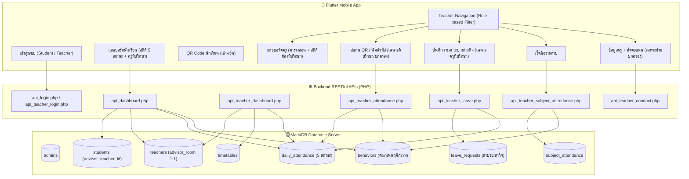

# 📑 เอกสารวิเคราะห์สถานะระบบ SmartSchool & ความพร้อมตามเป้าหมายฉบับสมบูรณ์

> **วันที่จัดทำ:** 26 กันยายน 2569  
> **เวอร์ชัน:** 2.0 (Post-SQL Migration & Teacher Leave Module Update)  
> **สถานะภาพรวม:** **ความพร้อมของระบบขยับขึ้นจาก 50-55% เป็น ~78 - 80%** (ฐานข้อมูล 100% | Backend APIs หลัก 85% | Mobile App ฝั่งครูและนักเรียน 80% | Admin 30%)

---

## 📌 1. บทสรุปความคืบหน้า (Executive Progress Summary)

จากการตรวจสอบย้อนหลังจากเวอร์ชันเริ่มต้นเทียบกับปัจจุบัน หลังจากที่ได้ดำเนินการรัน **SQL Database Migration** และปรับปรุงโค้ดระบบ:

1. **ฐานข้อมูล (Database Schema):** **สำเร็จ 100%**
   - ตาราง `leave_requests` ถูกสร้างขึ้นจริง รองรับการบันทึกการลาป่วย/ลากิจ ของครูที่ปรึกษา
   - ปรับ `daily_status` ใน `daily_attendance` เป็น ENUM ที่แยกลาป่วยและลากิจได้จริง
   - เพิ่มคอลัมน์ `advisor_room` แบบ UNIQUE ในตาราง `teachers` (ผูก 1 ครู : 1 ห้อง)
   - เพิ่มคอลัมน์ `advisor_teacher_id` ในตาราง `students` พร้อม Foreign Key
   - เพิ่มบัญชีระบบ `'SYSTEM'` ในตาราง `teachers` ป้องกัน Foreign Key Constraint Error
   - สร้างตาราง `admins` พร้อมบัญชี Super Admin เริ่มต้น

2. **ระบบหลังบ้าน (Backend RESTful APIs):** **สำเร็จ ~85%**
   - [api_dashboard.php](file:///d:/Smart_School/backend/api/api_dashboard.php): ดึงครูที่ปรึกษาจากความสัมพันธ์จริง, แยกลาป่วย/ลากิจ, และเพิ่มตรรกะแจ้งเตือนคะแนนความประพฤติต่ำกว่า 80 คือ `"ต่ำกว่าเกณฑ์ (ไม่ผ่านเกณฑ์)"`
   - [api_teacher_dashboard.php](file:///d:/Smart_School/backend/api/api_teacher_dashboard.php): เพิ่มสถิติห้องที่ปรึกษา (`advisor_room_stats`) และรายชื่อนักเรียนที่ขาด/ลา (`absent_or_leave_list`), แก้ไขรูปแบบตารางสอนให้ตรงกับ Model
   - [api_teacher_leave.php](file:///d:/Smart_School/backend/api/api_teacher_leave.php): สร้างเสร็จสมบูรณ์ รองรับทั้ง POST (บันทึกและ sync เช็คชื่อ), GET (ดูประวัติ), และ DELETE (ยกเลิกการลา)
   - [api_teacher_subject_attendance.php](file:///d:/Smart_School/backend/api/api_teacher_subject_attendance.php): แก้ไขบั๊กฮาร์ดโค้ด `SYSTEM` เปลี่ยนมาใช้ `teacher_id` จริงของครูผู้สอน

3. **แอปพลิเคชันมือถือ (Flutter Mobile Application):** **สำเร็จ ~80%**
   - [teacher_navigation.dart](file:///d:/Smart_School/flutter_application_1/lib/screens/teacher/teacher_navigation.dart): เพิ่มระบบคัดกรองการมองเห็นแท็บตามบทบาทจริง (`canScanQr = isDisciplinary || isAdvisor`, `canRecordLeave = isAdvisor`)
   - [teacher_home_screen.dart](file:///d:/Smart_School/flutter_application_1/lib/screens/teacher/teacher_home_screen.dart): ปรับระบบการสลับหน้าจอด้วย `TeacherTab` enum และเพิ่มปุ่มด่วนสำหรับบันทึกการลา
   - [teacher_leave_screen.dart](file:///d:/Smart_School/flutter_application_1/lib/screens/teacher/teacher_leave_screen.dart): **สร้างหน้าจอใหม่เสร็จสมบูรณ์ 100%** มีระบบเลือกนักเรียนในห้องที่ปรึกษา, เลือกประเภทลา, เลือกวันที่, บันทึกผล, ดูประวัติ, และกดยกเลิกการลา
   - [api_service.dart](file:///d:/Smart_School/flutter_application_1/lib/services/api_service.dart): เพิ่ม Method การเชื่อมต่อ API การลาครบถ้วน
   - **ผลการทดสอบโค้ด:** รัน `flutter analyze` ผ่านฉลุย 0 Errors / 0 Warnings

---

## 🔍 2. ตารางตรวจสอบความครบถ้วนรายข้อกำหนด (Detailed Gap Audit Matrix)

### 👨‍🎓 2.1 บทบาท: นักเรียน (Student)

| ข้อกำหนดตามความต้องการ | สถานะความพร้อม | ไฟล์ที่เกี่ยวข้อง | รายละเอียดการทำงานและสิ่งที่ยังขาด |
| :--- | :---: | :--- | :--- |
| **1. มีรหัสตัวเองเพื่อเข้าสู่ระบบ** | ✅ **สมบูรณ์ 100%** | [login_screen.dart](file:///d:/Smart_School/flutter_application_1/lib/screens/auth/login_screen.dart)<br>[api_login.php](file:///d:/Smart_School/backend/api/api_login.php) | เข้าสู่ระบบด้วย `student_id` และ `password` ได้ทั้งแบบ BCrypt Hash และ Plain-text เดิม |
| **2. แดชบอร์ดดู มา, สาย, ขาด, ลากิจ, ลาป่วย, อาจารย์ที่ปรึกษา** | ✅ **สมบูรณ์ 100%** | [api_dashboard.php](file:///d:/Smart_School/backend/api/api_dashboard.php#L123)<br>[home_screen.dart](file:///d:/Smart_School/flutter_application_1/lib/screens/home/home_screen.dart) | • แสดงสถิติแยกลาป่วยและลากิจอย่างแม่นยำจากฐานข้อมูล<br>• แสดงชื่อและเบอร์ติดต่ออาจารย์ที่ปรึกษาตัวจริงตามห้องที่สังกัด |
| **3. ดูคะแนนพฤติกรรม/ประวัติ หากต่ำกว่า 80 ไม่ผ่านเกณฑ์** | ⚠️ **พร้อม 90%**<br>*(รอปรับสี Badge)* | [api_dashboard.php](file:///d:/Smart_School/backend/api/api_dashboard.php#L175)<br>[conduct_card.dart](file:///d:/Smart_School/flutter_application_1/lib/screens/home/widgets/conduct_card.dart) | • **Backend:** คำนวณตัด/เพิ่มคะแนนถูกต้อง และกำหนดข้อความชัดเจนว่าถ้าคะแนน < 80 คือ `"ต่ำกว่าเกณฑ์ (ไม่ผ่านเกณฑ์)"`<br>• **UI ฝั่งแอป:** ปัจจุบันแสดงข้อความตาม Backend แล้ว แต่แนะนำให้เปลี่ยนสีกล่องข้อความเป็นสีแดงเตือนเมื่อไม่ผ่านเกณฑ์ |
| **4. ดูเกรดแต่ละรายวิชาได้** | ✅ **สมบูรณ์ 100%** | [grades_screen.dart](file:///d:/Smart_School/flutter_application_1/lib/screens/grades/grades_screen.dart)<br>[api_grades.php](file:///d:/Smart_School/backend/api/api_grades.php) | แสดงรายวิชา เกรด คะแนนรวม หน่วยกิต และคำนวณ GPAX ถูกต้องตามหลักสูตร |
| **5. ดูประวัติส่วนตัวและข้อมูลผู้ปกครอง** | ✅ **สมบูรณ์ 100%** | [profile_screen.dart](file:///d:/Smart_School/flutter_application_1/lib/screens/profile/profile_screen.dart)<br>[guardian_card.dart](file:///d:/Smart_School/flutter_application_1/lib/screens/home/widgets/guardian_card.dart) | แสดงข้อมูลผู้เรียน เบอร์โทร ที่อยู่ และข้อมูลผู้ปกครองครบถ้วน |
| **6. สแกน QR เช้า-เย็น (ไม่สแกนช่วงใดช่วงหนึ่ง -3, ลาในไลน์แล้วครูกรอก)** | ✅ **สมบูรณ์ 100%** | [qr_screen.dart](file:///d:/Smart_School/flutter_application_1/lib/screens/qr/qr_screen.dart)<br>[teacher_leave_screen.dart](file:///d:/Smart_School/flutter_application_1/lib/screens/teacher/teacher_leave_screen.dart) | • สแกนเช้าและเย็นทำงานได้จริง มีระบบหัก 3 คะแนนหากขาดช่วงใดช่วงหนึ่ง<br>• หากนักเรียนลาในไลน์ ครูประจำชั้นสามารถเปิดหน้าระบบบันทึกการลาเพื่อลงข้อมูลแทนได้ทันที |
| **7. สแกนเกิน 8:00 หักนาทีละ 0.1, หากไม่สแกนเลย เที่ยงวันถือว่าขาด** | ✅ **สมบูรณ์ 100%** | [api_teacher_attendance.php](file:///d:/Smart_School/backend/api/api_teacher_attendance.php)<br>[cron_daily_check.php](file:///d:/Smart_School/backend/api/cron_daily_check.php) | • สแกนสายหลัง 08:00 น. คำนวณหักนาทีละ 0.1 คะแนนถูกต้องแล้ว<br>• สร้างสคริปต์ [cron_daily_check.php](file:///d:/Smart_School/backend/api/cron_daily_check.php) รองรับการรันตรวจเช็กอัตโนมัติเวลา 12:00 น. เพื่อปรับสถานะคนที่ไม่มีการเช็คชื่อเป็น "ขาด" และหัก 3 คะแนนเรียบร้อยแล้ว |
| **8. ดูตารางเรียนตัวเองได้** | ✅ **สมบูรณ์ 100%** | [full_timetable_screen.dart](file:///d:/Smart_School/flutter_application_1/lib/screens/timetable/full_timetable_screen.dart) | แสดงตารางเรียนรายวันและรายสัปดาห์ (จันทร์ - ศุกร์) ครบถ้วน |

---

### 👩‍🏫 2.2 บทบาท: ครู (Teacher)

| ข้อกำหนดตามความต้องการ | สถานะความพร้อม | ไฟล์ที่เกี่ยวข้อง | รายละเอียดการทำงานและสิ่งที่ยังขาด |
| :--- | :---: | :--- | :--- |
| **1. มีรหัสประจำตัวครูเพื่อเข้าสู่ระบบ** | ✅ **สมบูรณ์ 100%** | [login_screen.dart](file:///d:/Smart_School/flutter_application_1/lib/screens/auth/login_screen.dart)<br>[api_teacher_login.php](file:///d:/Smart_School/backend/api/api_teacher_login.php) | ล็อกอินด้วยรหัสครู (เช่น `T001`) และรหัสผ่านเข้าสู่โหมดครูได้ถูกต้อง |
| **2. แดชบอร์ดดูคาบสอนวันนี้, สถิติห้องที่ปรึกษา (1:1) มา/สาย/ป่วย/กิจ/ขาด และดูได้ว่าใครขาดใครลา** | ⚠️ **พร้อม 85%**<br>*(รอแสดงรายชื่อใน UI)* | [api_teacher_dashboard.php](file:///d:/Smart_School/backend/api/api_teacher_dashboard.php#L102)<br>[teacher_home_screen.dart](file:///d:/Smart_School/flutter_application_1/lib/screens/teacher/teacher_home_screen.dart) | • **Backend:** คำนวณสถิติห้องที่ปรึกษาแยกมา/สาย/ป่วย/กิจ/ขาด ครบ และส่ง `absent_or_leave_list` (รายชื่อเด็กที่ขาด/ลา) มาให้แล้ว<br>• **UI ฝั่งแอป:** แก้ไขตารางสอนให้แสดงชื่อวิชาถูกต้องแล้ว เหลือเพียงเพิ่มการ์ดแสดงรายชื่อเด็กที่ขาด/ลา ในหน้าแดชบอร์ด |
| **3. ระบบบันทึกการลา (กรอกเฉพาะห้องตัวเอง, ไม่ใช่ที่ปรึกษาให้ซ่อนปุ่ม)** | ✅ **สมบูรณ์ 100%** | [teacher_leave_screen.dart](file:///d:/Smart_School/flutter_application_1/lib/screens/teacher/teacher_leave_screen.dart)<br>[api_teacher_leave.php](file:///d:/Smart_School/backend/api/api_teacher_leave.php) | • ดึงเฉพาะนักเรียนในห้องที่ปรึกษาของตนเองมาให้เลือก<br>• แยกลาป่วย/ลากิจ พร้อมระบุวันที่และเหตุผล<br>• ซ่อนแท็บและเมนูออกจากหน้าระบบอัตโนมัติหากครูคนนั้นไม่ได้เป็นครูที่ปรึกษา |
| **4. เช็คชื่อคาบที่ตัวเองสอน ดูกี่ห้องกี่คาบก็ได้ ดูข้ามวันได้** | ⚠️ **พร้อม 65%**<br>*(รอปรับ UI หน้าเช็คชื่อ)* | [api_teacher_subject_attendance.php](file:///d:/Smart_School/backend/api/api_teacher_subject_attendance.php)<br>[teacher_attendance_screen.dart](file:///d:/Smart_School/flutter_application_1/lib/screens/teacher/teacher_attendance_screen.dart) | • **Backend:** แก้ไข Bug Foreign Key แล้ว รองรับการบันทึกขาดและตัดคะแนนถูกต้อง<br>• **UI ฝั่งแอป:** ปัจจุบัน [teacher_attendance_screen.dart](file:///d:/Smart_School/flutter_application_1/lib/screens/teacher/teacher_attendance_screen.dart) ยังเป็นหน้าเลือกห้องเรียนแบบฮาร์ดโค้ด และยิงเข้า Daily Attendance แทนที่จะเป็น Subject Attendance ต้องปรับให้เลือกวันที่และเลือกคาบเรียนที่ตนเองสอน |
| **5. สแกน QR เช้า-เย็น / พิมพ์รหัสแทนได้ / ซ่อนปุ่มถ้าไม่ใช่ที่ปรึกษาหรือครูปกครอง** | ✅ **สมบูรณ์ 100%** | [teacher_navigation.dart](file:///d:/Smart_School/flutter_application_1/lib/screens/teacher/teacher_navigation.dart#L36)<br>[teacher_qr_scanner_screen.dart](file:///d:/Smart_School/flutter_application_1/lib/screens/teacher/teacher_qr_scanner_screen.dart) | • สแกนกล้อง QR หรือพิมพ์รหัสนักเรียนเพื่อเช็คชื่อได้<br>• ตรวจสอบสิทธิ์ `canScanQr = teacher.isDisciplinary || teacher.isAdvisor` หากไม่ใช่ทั้งสองบทบาทจะซ่อนแท็บสแกนทันที |
| **6. บวก/ลบคะแนนพฤติกรรม เฉพาะฝ่ายปกครอง หากไม่ใช่ให้ซ่อน** | ⚠️ **พร้อม 80%**<br>*(รอครอบ if ใน UI)* | [api_teacher_conduct.php](file:///d:/Smart_School/backend/api/api_teacher_conduct.php)<br>[teacher_profile_screen.dart](file:///d:/Smart_School/flutter_application_1/lib/screens/teacher/teacher_profile_screen.dart#L144) | • **Backend:** ตรวจสิทธิ์ใน API แล้วว่าต้องเป็นฝ่ายปกครองเท่านั้น<br>• **UI ฝั่งแอป:** ปัจจุบันแค่ Disable ช่องกรอก ต้องแก้ให้ครอบด้วย `if (widget.teacher.isDisciplinary)` เพื่อซ่อนฟอร์มไปเลย |
| **7. ดูข้อมูลส่วนตัวครูได้** | ✅ **สมบูรณ์ 100%** | [teacher_profile_screen.dart](file:///d:/Smart_School/flutter_application_1/lib/screens/teacher/teacher_profile_screen.dart) | แสดงกลุ่มสาระ เบอร์โทร ที่อยู่ หมู่เลือด และห้องที่ปรึกษาครบถ้วน |

---

### 👑 2.3 บทบาท: ผู้ดูแลระบบ (Admin)

| ข้อกำหนดตามความต้องการ | สถานะความพร้อม | รายละเอียด |
| :--- | :---: | :--- |
| **1. โครงสร้างฐานข้อมูล Admin** | ✅ **สมบูรณ์ 100%** | ตาราง `admins` ถูกสร้างขึ้นจริง รองรับ `superadmin`, `admin`, `registrar` และสร้างบัญชีตั้งต้น `admin` แล้ว |
| **2. หน้าจอเว็บ Portal จัดการข้อมูล (CRUD)** | ❌ **ยังไม่มี (0%)** | ยังไม่มีหน้าเว็บสำหรับ Admin ในการล็อกอิน, จัดการข้อมูลครู (มอบหมาย `advisor_room`), จัดการนักเรียน, และจัดตารางสอน ปัจจุบันต้องทำผ่าน phpMyAdmin |

---

## 🏛️ 3. แผนผังความสัมพันธ์ของระบบปัจจุบัน (Current System Architecture)



---

## 🚀 4. แผนงานขั้นถัดไปเพื่อพิชิตเป้าหมาย 100% บริบูรณ์ (Final Roadmap)

```
[งานที่ทำเสร็จแล้ว]
  ✅ Phase 1: รัน SQL Migration ครบทุกตารางและฟิลด์
  ✅ Phase 2: แก้ไข Backend APIs หลัก (Dashboard, Leave, Attendance Bug)
  ✅ Phase 3.1: เพิ่มระบบซ่อนแท็บตาม Role ครูใน Flutter
  ✅ Phase 3.2: สร้างหน้าจอ teacher_leave_screen.dart ครบวงจร

[งานที่ต้องทำต่อให้ครบ 100%]
  ├── 1. UI Refinement (ใช้เวลา ~15-20 นาที)
  │    ├── ซ่อนฟอร์มตัดคะแนนใน teacher_profile_screen.dart ถ้าไม่ใช่ฝ่ายปกครอง
  │    ├── ปรับสี Badge ใน conduct_card.dart เป็นสีแดงเมื่อคะแนน < 80
  │    └── ปรับ teacher_attendance_screen.dart ให้ดึงคาบสอนจริง + เลือกวันที่ได้
  │
  ├── 2. Background Automation (ใช้เวลา ~10 นาที)
  │    └── สร้าง cron_daily_check.php สำหรับรันเช็คขาดตอน 12:00 น.
  │
  └── 3. Admin Web Portal (Phase สุดท้าย)
       └── สร้างหน้าเว็บ Admin พื้นฐานสำหรับล็อกอินและจัดการครู/นักเรียน
```
